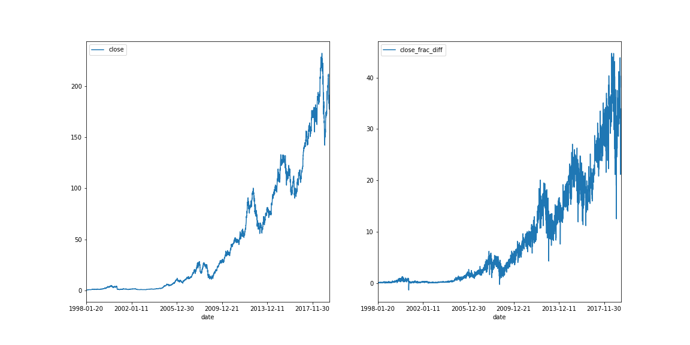
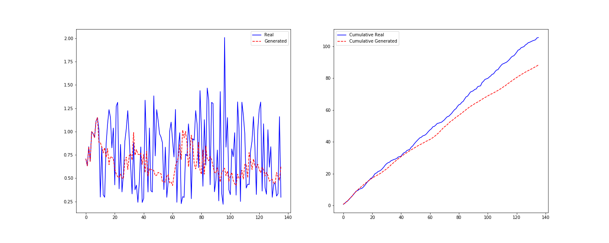
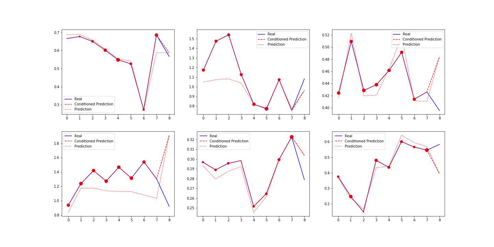

# Transforming Market Data

Experiment with using [Transformer](https://arxiv.org/abs/1706.03762) for time series market data augmentation.

## Intro

Market data are extremely limited. Even considering minute scale, 10 years of trading records would
give only around ~50,000 points, which is quite small at the scale of machine learning models (and
deep learning in particular). If we add the fact that long term history is usually way less
reliable for future predictions, it significantly complicates the things. If it was possible to generate
synthetic market data with similar underlying properties, such data augmentation would allow to use more complex models
with lower risk of overfitting, or use data intense approaches like reinforcement learning. This mini project is aiming to 
give a try to generate such kind of data.

Transformer models has been proven to be extremely successfull on a variety of tasks related
to data generation. Inspired by [OpenAI GPT2](https://openai.com/blog/better-language-models/) results,
I wanted to apply similar approach to generate time series market data.

## Data

For a sake of example, I use daily scale data of Apple Inc. (AAPL) for the last 20 years
(downloaded from [Alpha Vantage](https://www.alphavantage.co/documentation/)). I use close price data
adjusted for splits, and use fractional differentiation to shrink the scale and make it more stationary while
preserving memory:



## Train model

To train the model, install the package and run:

```bash
train-model --checkpoint_dir data/ckpt --data_path data/AAPL_daily.json --splits_data data/AAPL_splits.json
```

## Generate new data

Conditioning model on the input sequence (taken from unseen validation set), here is an example of generated sequence after
approximately 30 epochs of training:



Plot on the left shows raw real and generated sequences, while plot on the right shows cumulative sequences to
show the general trend. Looks not as bad for a quick try! It is clear that model has much lower variance in general,
but it gets correctly the overall trend.

## Visualizing model attention

Main feature of transformer model is self-attention mechanism, which helps model to find and "focus" on important patterns
and catch positional (temporal) dependencies. Attention matrix can be visualized and display what model finds more or 
less important in the input sequence.



The plot above shows examples of model output given different input sequences. *Conditioned prediction* shows prediction
for last point given the full input sequence, while *Prediction* shows model output at each time step `t_n` given input so
far (`t_0`, `t_1`, .... `t_n-1` ). Scatter dots shows the amount of attention model assigns to each value in the input 
sequence.

## What's next

At the moment, this is a quick demonstration of what can be done applying transformer almost out of the box with
minimal data preparation. Ideally, next steps would be:
* Proper tune model to let it have higher variance
* Use statistical test to check if generated sequence is similar to the ground truth data
* Try using generative adversarial model (GAN) to improve data generation